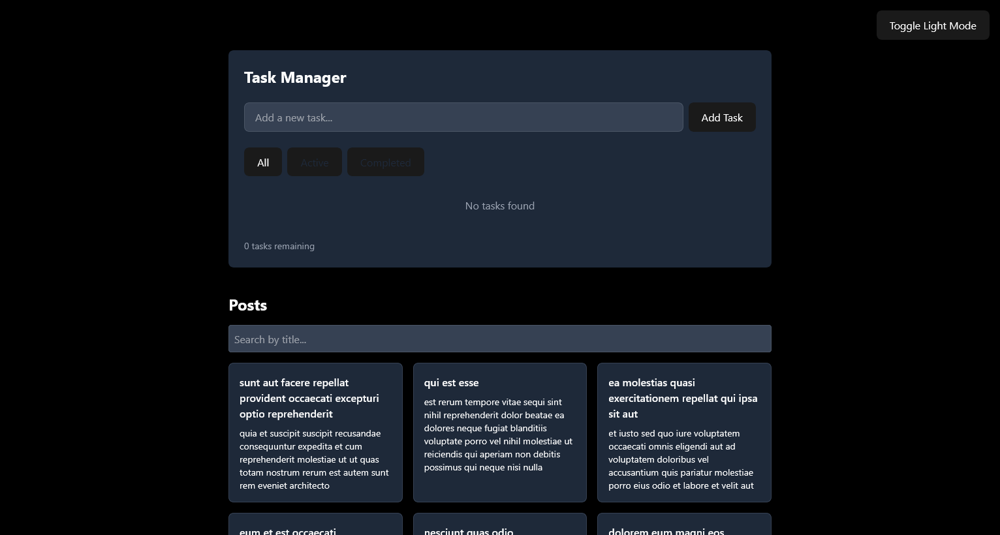
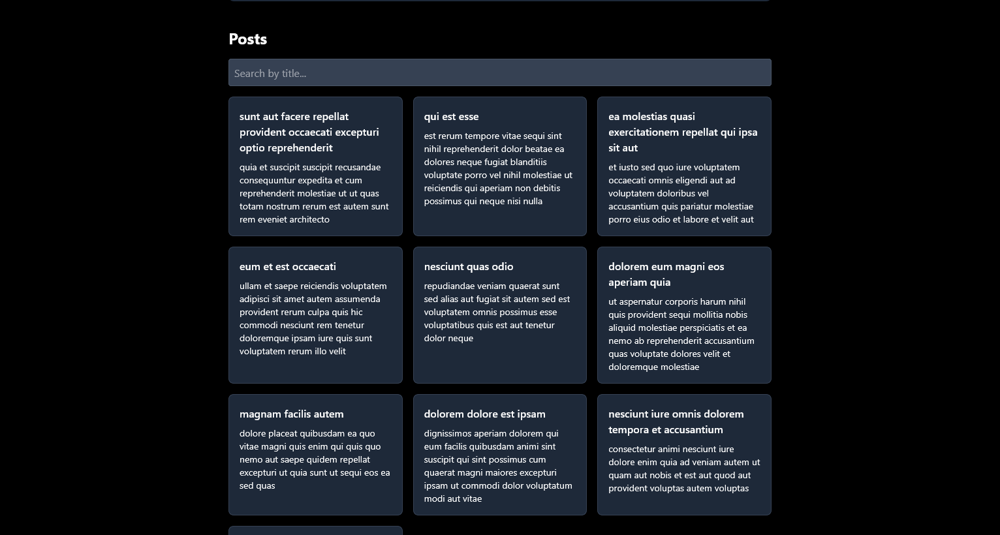

```md
# 🚀 Week 3 React JS Assignment – Task Manager & Post List

This is a responsive React application built with **Vite** and styled using **Tailwind CSS**. It features a fully functional **Task Manager**, a **Post List** fetched from an external API, and a **Dark/Light Mode** toggle with persistence.

🔗 **Live Demo**: [https://week-3-react-js-assignment-noahnalh.netlify.app](https://week-3-react-js-assignment-noahnalh.netlify.app)

---

## ✨ Features

### ✅ Task Manager
- Add, complete, and delete tasks
- Filter by: All | Active | Completed
- Persistent storage using localStorage

### 📰 Post List
- Fetches posts from [JSONPlaceholder](https://jsonplaceholder.typicode.com)
- Live search by title
- Pagination with 10 posts per page
- Responsive layout

### 🌗 Theme Support
- Toggle between **Light** and **Dark** mode
- Detects system preference by default
- Saves preference using localStorage

---

## 🖼 Screenshots

### 🧩 Task Manager  


### 📚 Post List  


---
```

## 📁 Project Structure

```
📦 week-3-react-js-assignment-noahnalh
├── public/
│   └── screenshots/
│       ├── Taskmanager.png
│       └── Postlist.png
├── src/
│   ├── components/
│   │   ├── Button.jsx
│   │   ├── Card.jsx
│   │   ├── Footer.jsx
│   │   ├── ItemList.jsx
│   │   ├── Layout.jsx
│   │   ├── Navbar.jsx
│   │   ├── PostItem.jsx
│   │   ├── PostList.jsx
│   │   ├── TaskItem.jsx
│   │   ├── TaskManager.jsx
│   │   ├── ThemeContext.jsx
│   │   ├── ThemeToggle.jsx
│   │   └── useLocalStorage.js
│   ├── App.css
│   ├── App.jsx
│   ├── Home.jsx
│   ├── index.css
│   ├── index.js
│   └── Main.jsx
├── .gitignore
├── eslint.config.js
├── index.html
├── package.json
├── pnpm-lock.yaml
├── README.md
├── tailwind.config.js
└── vite.config.js
```

```md
---

## ⚙️ Installation & Setup

### 1. Clone the Repository

```bash
git clone https://github.com/PLP-MERN-Stack-Development/week-3-react-js-assignment-noahnalh.git
cd week-3-react-js-assignment-noahnalh
```

### 2. Install Dependencies

```bash
pnpm install
```

### 3. Run the Development Server

```bash
pnpm run dev
```

### 4. Build for Production

```bash
pnpm run build
```

### 5. Preview Production Build

```bash
pnpm run preview
```

---

## 🧑‍💻 Author

**Noah Nalh**  
GitHub: [@noahnalh](https://github.com/noahnalh)

---

